# A small experiment on the use of the hiding-based algorithm of HIBOU to recognize multi-prefixes and their mutants via ORV from interaction models

Multi-traces are sets of local traces, each corresponding to a sequence of communication actions (emissions or receptions of messages) 
that are observed locally on a specific sub-system or set of co-localized sub-systems. 
A multi-trace is hence a collection of local observations of the same global behavior (which is what was executed in the distributed system).

However not all sub-systems may be monitored and hence some local observations might be missing from the multi-trace.
In a less extreme case, it might be so that certain monitors cease their observation too early,
and, as a result, the corresponding local observation is a strict prefix of what really occurred on the corresponding sub-system.

Those two cases of partial observations can be handled in the same manner to provide Offline Runtime Verification from interaction models.
We propose an algorithm which uses removal/hiding operations to simplify on-the-fly the model whenever a subsystem ceases to be observed.
This is a different technique than the [simulation-based technique used here](https://github.com/erwanM974/hibou_slice_recognition_experiment).

As a specification language for assessing the conformance of multi-traces logged during the execution of a distributed system, 
we use a language of "interactions".
Interactions are formal models,
akin to Message Sequence Charts or UML Sequence Diagrams for their graphical representation,
but more related to process algebra for their structure and the manner in which we exploit them, via an operational-style semantics.

This experiment constitutes a small-scale experimental validation of the hiding-based algorithm which is implemented in the HIBOU tool
(see "[hibou_label](https://github.com/erwanM974/hibou_label)").

## Input interaction models

We consider 4 interactions which formalize a specification found in the litterature:

| [A modelisaton of the Alternating Bit Protocol](https://satoss.uni.lu/members/sjouke/papers/MaRe97.pdf) | [A usecase on a system for querying sensor data](https://josis.org/index.php/josis/article/view/38) |
|---------------------------------------------------------------------------------------------------------|-----------------------------------------------------------------------------------------------------|
| 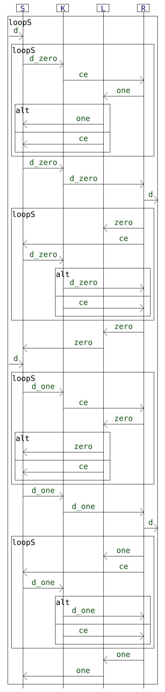                                               | 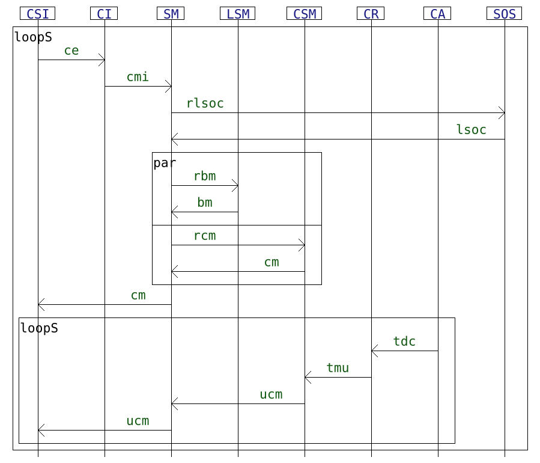                                     | 

| [A toy example describing the purchase of a book](https://link.springer.com/chapter/10.1007/978-3-319-94580-4_5) | [An example on a system for uploading data to a server](https://programming-journal.org/2019/3/6/) |
|------------------------------------------------------------------------------------------------------------------|----------------------------------------------------------------------------------------------------|
| 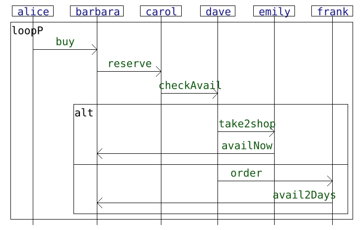                                                  | 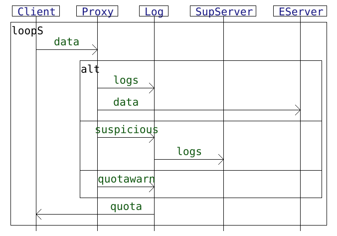                                  |

## Generating input data

For every interaction *i* from our set of usecase interactions *I*, 
we generate a number of accepted multi-traces 
using the semantics exploration feature of HIBOU and a trace generation logger.
For each *i* a set *T(i)* of such accepted multi-traces is thus obtained.
Given the presence of loops in models, *T(i)* is defined by limiting the exploration according to certain criteria
which is given, for each one of the 4 example, on the first row the the table below.

For every such accepted multi-trace, we then generate a number of prefixes by removing events at the end of its local trace components.
The second line of the table below states the criteria for selecting those prefixes.

Finally, for every such prefix, we perform some mutations so as to obtain mutant multi-traces which may (or may not) go out of specification.
We consider three distinct kinds of mutation:
- swapping the order of actions within a given trace component of a given multi-trace
- inserting random actions within a given multi-trace (respecting the composition of its components i.e. the lifelines on which actions are supposed to occur)
- swapping components on the same co-localization between two different multi-traces (this mutation is interesting given that it ensures every local component to remain correct even though the global scenario i.e. multi-trace may then not be correct)

|                      | [Book oder](https://link.springer.com/chapter/10.1007/978-3-319-94580-4_5) | [Sensor](https://josis.org/index.php/josis/article/view/38)        | [ABP](https://satoss.uni.lu/members/sjouke/papers/MaRe97.pdf)      | [Network](https://programming-journal.org/2019/3/6/)               |
|----------------------|----------------------------------------------------------------------------|--------------------------------------------------------------------|--------------------------------------------------------------------|--------------------------------------------------------------------|
| Exploration criteria | exhaustive within sub-tree s.t. loop <= 2                                  | random & partial (<= 10 000 nodes) within sub-tree s.t. loop <= 50 | random & partial (<= 35 000 nodes) within sub-tree s.t. loop <= 15 | random & partial (<= 20 000 nodes) within sub-tree s.t. loop <= 10 |
| Prefix selection     | 5 random (any) prefixes per accepted multi-trace                           | 5 random (wide only) prefixes per accepted multi-trace             | 5 random (wide only) prefixes per accepted multi-trace             | 5 random (wide only) prefixes per accepted multi-trace             |
| Mutant selection     | 1 mutant of each kind per prefix                                           | 1 mutant of each kind per prefix                                   | 1 mutant of each kind per prefix                                   | 1 mutant of each kind per prefix                                   |

In the following, we label as:
- 'ACPT' the exactly accepted multi-traces
- 'PREF' the prefixes
- 'SACT' the mutants obtained by swapping the order of actions
- 'NOIS' the mutants obtained by inserting random actions (noise)
- 'SCMP' the mutants obtained by swapping local components between prefixes

## Running the experiment:

We analyse all the multi-traces against their corresponding interaction specification using a certain configuration of HIBOU.
In order to test a feature of 'local analysis' of the tool, we use two different configurations of the analysis algorithm which are encoded in the files:
- "conf_noloc.hcf" for not using 'local analyses'
- "conf_wtloc.hcf" for using 'local analyses'

Concretely, we run two instances of hibou in parallel with both configurations.
When the quickest terminates we kill the slowest and take note of which configuration is quicker.

We take note of the time required to finish the analysis and produce a verdict.
In order to smooth the results by removing noise, we perform several tries (5) and
then consider the median time required for the analysis between those 5 tries for plotting the results.

For each interaction, we generate a ".csv" file containing the experimental data. Each line contains:
- the name of the multi-trace
- the kind of the multi-trace (ACPT, PREF, SACT, NOIS or SCMP)
- verdict of the analysis 
- the length of the trace
- the time taken by hibou (in seconds) for each of the 5 tries
- the quickest of the two configuration used by hibou for each of the 5 tries
- the median time taken by hibou (in seconds)

Below is given an example excerpt of the table for the "sensor" example.

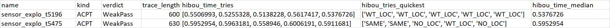

## Exploiting and plotting the data:

In the following we present results obtained running the experiment on an i5-8250U processor and 32Go of RAM.
We have used HIBOU version 0.8.1.

The raw data (generated traces and csv files) that we obtained is in the 'results' archive.

With the R code comprised in this repository, we extract statistical information from the "csv" tables that are generated
and draw scatterplots to represent the results graphically.

In those plots, each point corresponds to a given multi-trace.
Its position corresponds to the time taken to analyse it (on the *y* axis), and its length i.e. total number of actions (on the *x* axis, with some jitter added to better see distinct points).

The different colors of points correspond to the different kinds of multi-traces.
For each interaction, the legend specifies the number of points of each kind.

|            | [Book oder](https://link.springer.com/chapter/10.1007/978-3-319-94580-4_5)      | [Sensor](https://josis.org/index.php/josis/article/view/38)                 |
|------------|---------------------------------------------------------------------------------|-----------------------------------------------------------------------------|
| Plot       | 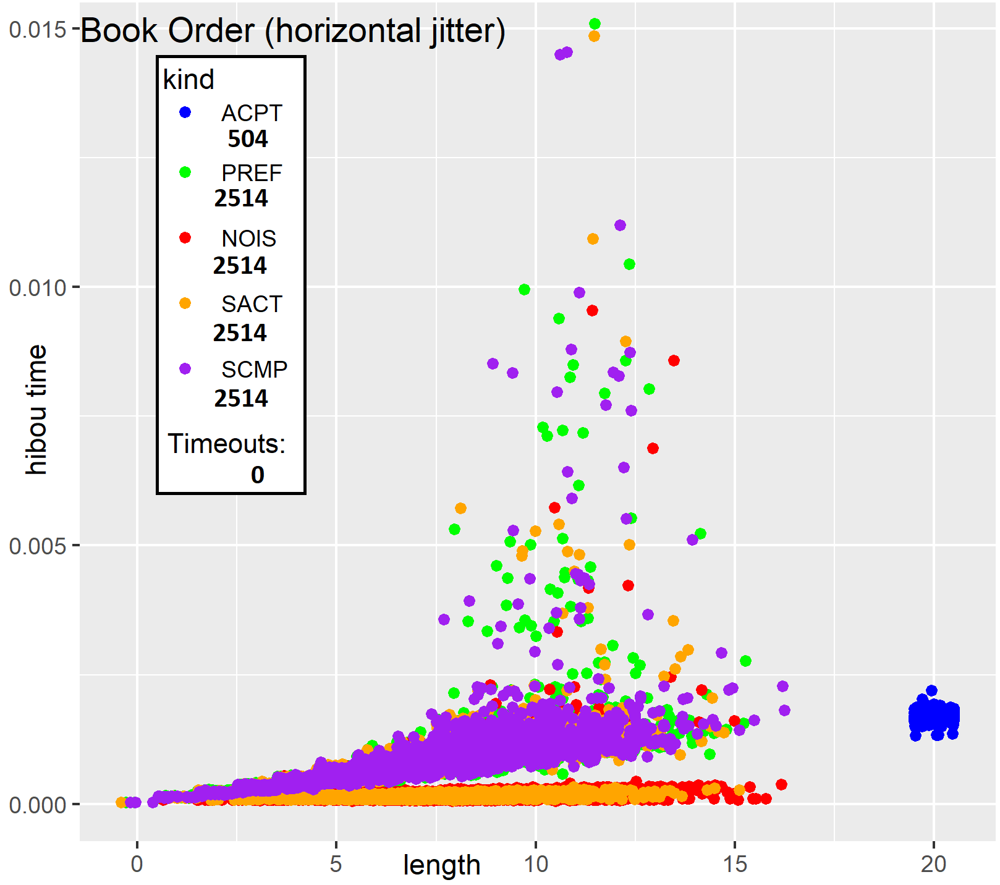    | 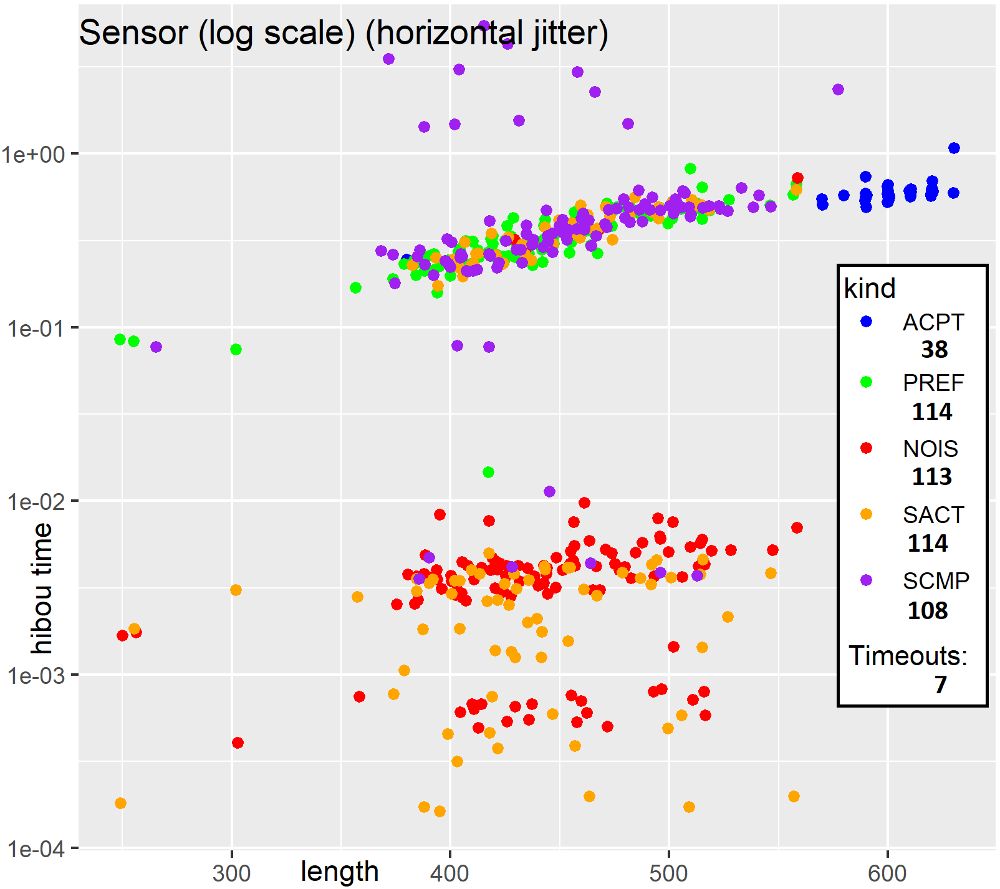    |
| Statistics | 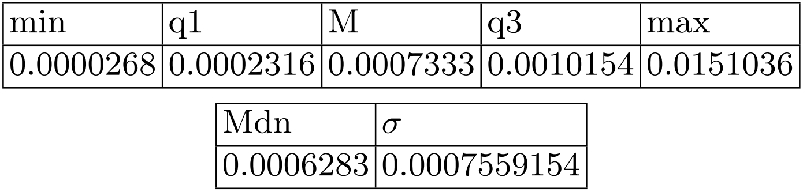 | 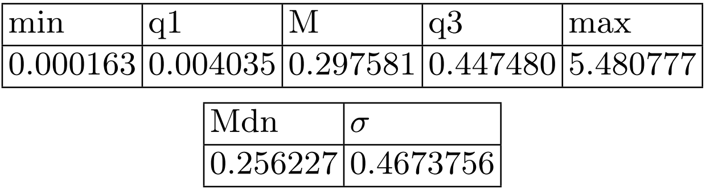 |

|            | [ABP](https://satoss.uni.lu/members/sjouke/papers/MaRe97.pdf)         | [Network](https://programming-journal.org/2019/3/6/)                          |
|------------|-----------------------------------------------------------------------|-------------------------------------------------------------------------------|
| Plot       | 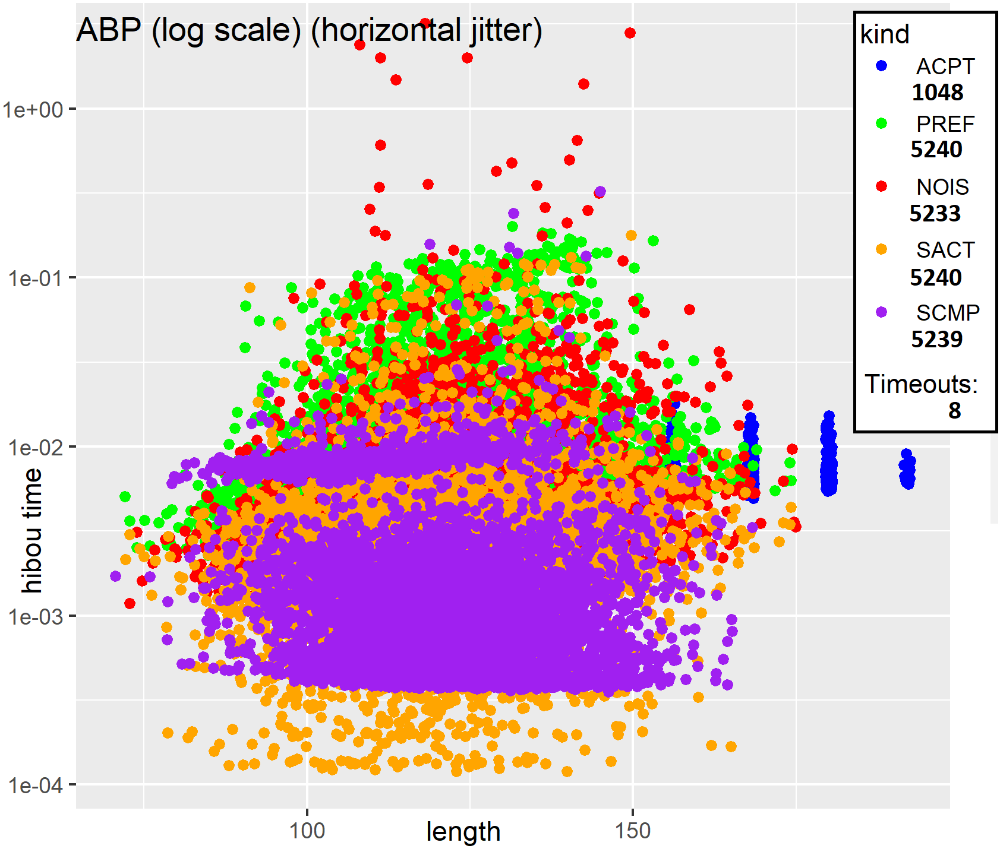    | 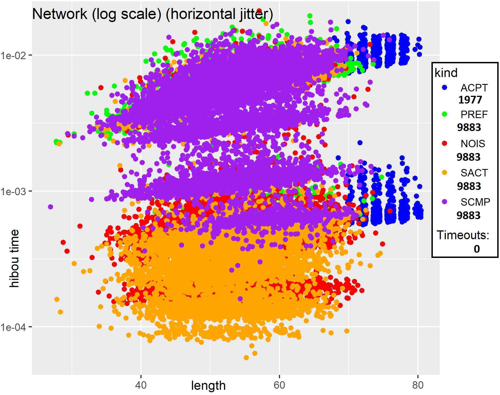    |
| Statistics | 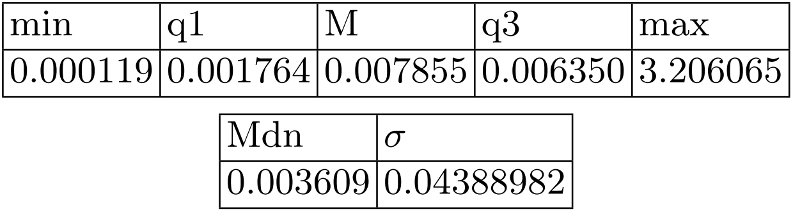 | 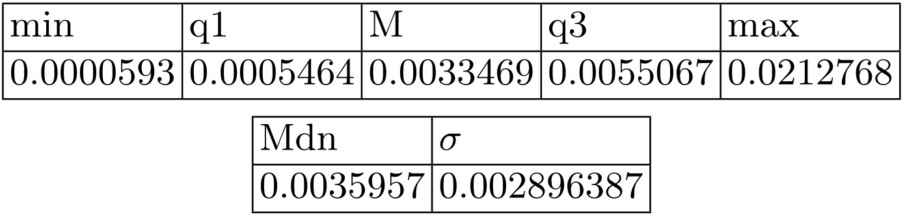 |

